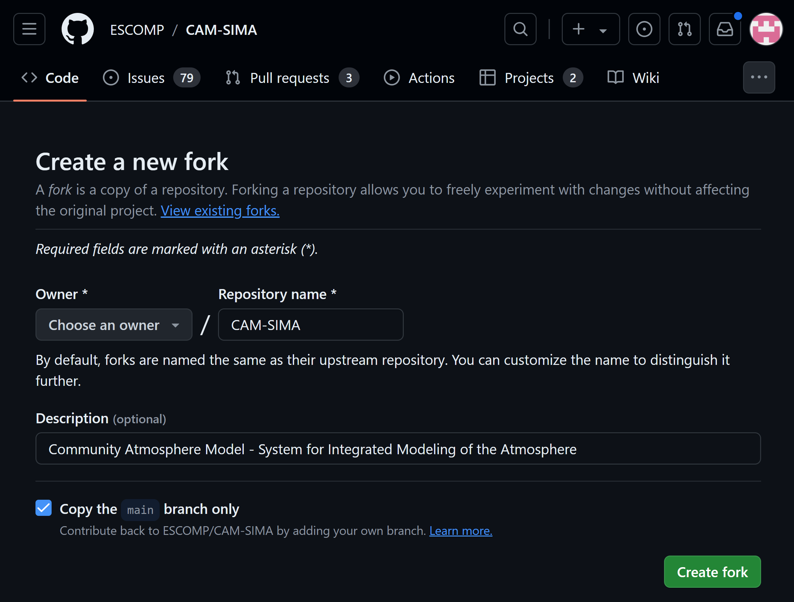

# CAM Parameterization to CCPP

## Background

### Running jobs in CAM and CAM-SIMA primer (experienced users can jump to the next section)

To make runs in either CAM or CAM-SIMA the commands are identical:
```bash
./create_newcase… #(the commands will differ and are specified later in this document)
cd YourCaseDirectory
./xmlchange… #(specific commands are specified later in this document)
./case.setup
./case.build
./case.submit
```

Depending on which machine you are on, you may prefer to run the ./case.build command on a compute node instead of the login node due to user resource utilization limits on the login nodes.

For more detailed information on case creation and building, see https://ncar.github.io/CAM/doc/build/html/users_guide/building-and-running-cam.html

## Prep Work

### Conversion Spreadsheet
Put the parameterization that you are going to convert into the conversion spreadsheet
https://docs.google.com/spreadsheets/d/1_1TTpnejam5jfrDqAORCCZtfkNhMRcu7cul37YTr_WM/edit#gid=0

### Create Github Issues
Create a Github Issue in the [ESCOMP/CAM](https://github.com/ESCOMP/CAM) repo that states which physics parameterization you are planning to convert to the CCPP framework.  Then create another issue in the [ESCOMP atmospheric physics](https://github.com/NCAR/atmospheric_physics) repo describing the same physics parameterization that you are now planning to add to the collection of NCAR CCPP physics suites.  Doing this allows the software engineers to keep track of which physics routines are being worked on, and which still need to be assigned.  The goal of converting the physics parameterization is to ultimately have the CCPP-ized physics package reside in [ESCOMP atmospheric physics](https://github.com/NCAR/atmospheric_physics) and be removed from [ESCOMP/CAM](https://github.com/ESCOMP/CAM).

### Setting up your sandbox

Make sure you have github forks for both ESCOMP/CAM-SIMA and ESCOMP/atmospheric_physics.  If needed see https://github.com/ESCOMP/Cam/wiki/CAM-Development-Workflow-in-GitHub#how-to-makestore-revisions-to-your-personal-cam-repository-github-fork


To begin, fork ESCOMP/CAM-SIMA:


And select the `Create new fork` option.  This will bring you to the "Create new fork" screen:


i!!! warning "Uncheck the "Copy the `main` branch only" option"

    Failure to uncheck this will prevent you from pulling in updates from the `development` branch easily.

As you make changes and want to commit them to your github repos, you will be managing two separate repos.  When you issue git commands, be aware of where you are in your code tree.  If you want to see changes in CAM-SIMA, you can issue a `git status` in the main CAM-SIMA directory.  If you want to see changes in the atmospheric_physics repo, make sure you are in `src/physics/ncar_ccpp` before you issue the `git status` command.  All other git commands will be relative to your current working directory as well.

### Opttional: pre-split tthe module

Many CAM schemes have more than one `run` function contained within them.  To seperate them into seperate files and test them:
 - In the copied atmospheric physics directory, create a seperate submodule for each parameterization which has `run` method.
   - An easy way to see what routines need to be seperated out is to look at the `use` statement(s) for your parameterization.  If more than one routine is listed, you most likely will need to seperate these out.
- If there is shared module level data or shared subroutines which are called internally, put these all in a `<schemename>_common.F90` module.

## CCPP-ization

### Convert the code in the "portable" parameterization layer

SCHEMES = the base level routines which are currently called bby the CAM interface routines.

1. Convert the original routines in the file you copied over to `src/physics/ncar_ccpp/<schemename>/<module_name>.F90` to one or more of the 5 following subroutines.  These will be called by CCPP in CAM-SIMA and in CAM6.

!!! note "`<module_name>` should be the full name of your module"

    For example, if you are converting the `tj2016` `precip_tend` function, then `<module_name>` would be `tj2016_precip_tend`.

Parameterizations may not need all of the routines listed below and do not need to supply them if they are not needed.  However, all subroutine input/output arguments need to have an `intent` label (you may refer to `src/atmos_phys/kessler` and `src/atmos_phys/held_suarez` for specific examples).

- `<module_name>_init`
  - Add all code that is run only during the first time step (`nstep=0`).  Typically fold `register` and `init` routines in current CAM into this routine.

- `<module_name>_timestep_init`
  - Add all pre-processing code needed by the scheme at the start of each timestep.  This may contain code from the CAM interface routine which prepares data for the run routine at each timestep.

- `<module_name>_run`
  - This is the workhorse routine which is run at each timestep.  The bulk of your ported code will likely be here.

- `<module_name>_timestep_final`
  - Add all post-processing code needed by the scheme at the end of each timestep.  This may contain code from the CAM interface routine which manipulates data after the run routine at each timestep.

- `<module_name>_final`
  - Most current CAM routines do not have code in this category.  This code is run once at the very end of the job.

