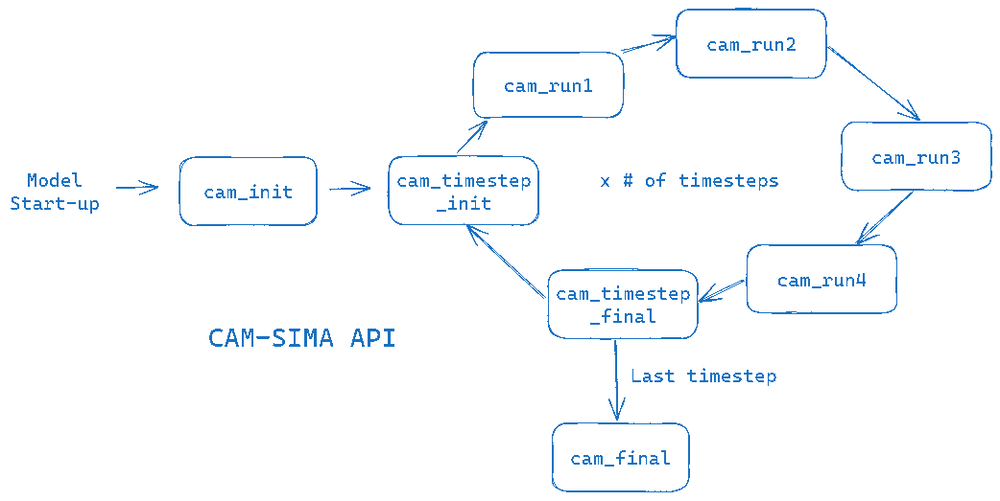
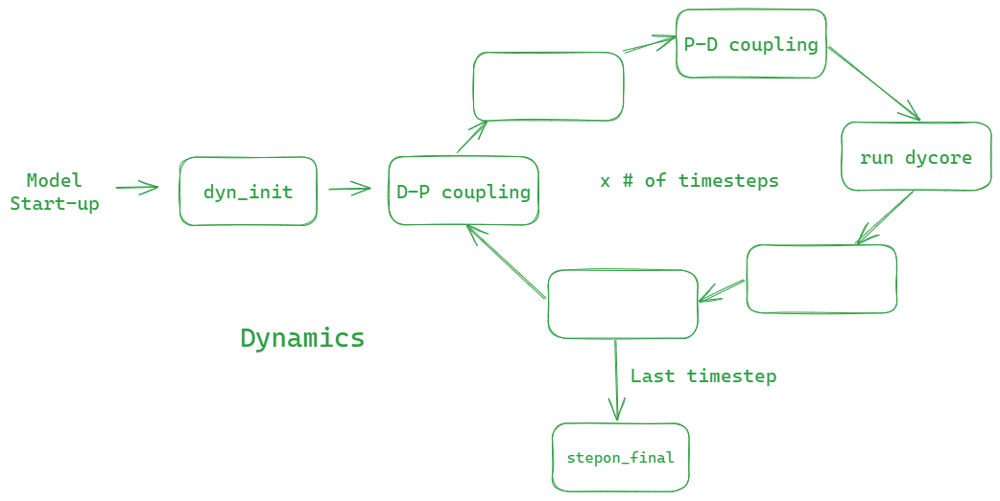
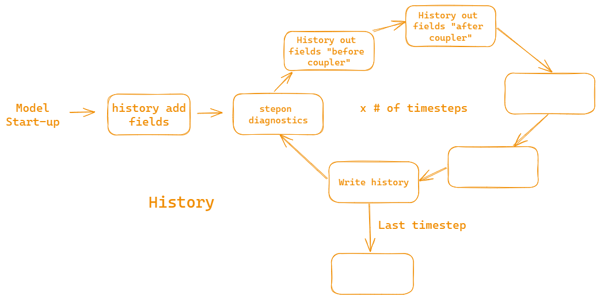

# Run process

<figure markdown="span">
  {width="80%"}
  <figcaption>CAM-SIMA run sequence*</figcaption>
</figure>

*Static images can be found at the [bottom](#static-run-sequence-images) of this page

## CAM-SIMA API
Upon running `./case.submit` the core CAM-SIMA driver code* is in `$CAM-SIMA/src/control/cam_comp.F90`. This section lays out each of the subroutines within `cam_comp.F90`.
The subroutines in `cam_comp.F90` are set up to mirror the phases of the [Common Community Physics Package](https://ccpp-techdoc.readthedocs.io/en/v6.0.0/) (CCPP).

\* `cam_comp.F90` subroutines are called by the NUOPC cap: `$CAM-SIMA/src/cpl/nuopc/atm_comp_nuopc.F90`

### cam_init
`cam_init` sets up the metadata and configuration objects/modules for the run. It is called by `atm_comp_nuopc.F90` at startup. Below are the variables passed in:

| Variable (intent)   | Definition                                                  | How it's Used                                       |
| :------------------ | :---------------------------------------------------------- | :-------------------------------------------------- |
| caseid (in)         | case name (as input to ./create_newcase)                    | metadata for cam_control_mod and cam_history        |
| ctitle (in)         | case title (matches caseid)                                 | metadata for cam_control_mod and cam_history        |
| model_doi_url (in)  | CESM model DOI (currently hard-coded to "non_set")          | metadata for cam_history                            |
| initial_run_in (in) | logical that is TRUE if this is a startup run**             | determines whether to call dyn_init or read restart |
| restart_run_in (in) | logical that is TRUE if this is a restart run**             | metadata for cam_control_mod                        |
| branch_run_in (in)  | logical that is TRUE if this is a branch run**              | metadata for cam_control_mod                        |
| post_assim_in (in)  | logical that is TRUE if data assimilation mode (DART) is on | metadata for cam_control_mod                        |
| calendar (in)       | calendar type (NOLEAP or GREGORIAN)                         | input to time manager init                          |
| brnch_retain_casename (in) | flag to allow a branch to use the same caseid as the run being branched from | metadata for cam_control_mod |
| aqua_planet (in)    | flag to run model in [aqua planet](https://www.cesm.ucar.edu/models/simple/aquaplanet) mode | metadata for cam_control_mod |
| single_column (in)  | flag to run the [single column model](https://www.cesm.ucar.edu/models/simple/scam) (SCAM) | passed into scam_readnl (not yet enabled in CAM-SIMA |
| scmlat (in)         | SCAM latitude                                               | passed into scam_readnl (not yet enabled in CAM-SIMA) |
| scmlon (in)         | SCAM longitude                                              | passed into scam_readnl (not yet enabled in CAM-SIMA) |
| eccen (in)          | Earth's eccentricity factor                                 | used to set module-level `eccen` in cam_control_mod  |
| obliqr (in)         | Earth's obliquity in radians                                | used to set module-level `obliqr` in cam_control_mod |
| lambm0 (in)         | Mean longitude of perihelion at the vernal equinox (radians)| used to set module-level `lambm0` in cam_control_mod |
| mvelpp (in)         | Earth's moving vernal equinox longitude of perihelion plus pi (radians) | used to set module-level `mvelpp` in cam_control_mod |
| perpetual_run (in)  | flag to determine if perpetual mode is enabled              | passed to time manager init                         |
| perpetual_ymd (in)  | perpetual year, month, day (YYYYMMDD) used to determine the sun position and interpolate boundary data sets | passed to time manager init |
| dtime (in)          | model timestep size in seconds                              | passed to time manager init                         |
| start_ymd (in)      | start date (YYYYMMDD)                                       | passed to time manager init                         |
| start_tod (in)      | start time of day (sec)                                     | passed to time manager init                         |
| ref_ymd (in)        | reference date (YYYYMMDD) (defaults to start_ymd)           | passed to time manager init                         |
| ref_tod (in)        | reference time of day (sec) (defaults to start_tod)         | passed to time manager init                         |
| stop_ymd (in)       | stop date (YYYYMMDD)                                        | passed to time manager init                         |
| stop_tod (in)       | stop time of day (sec)                                      | passed to time manager init                         |
| curr_ymd (in)       | current date (YYYYMMDD) (same as start date)                | passed to time manager init                         |
| curr_tod (in)       | current time of day (sec) (same as start tod)               | passed to time manager init                         |
| cam_in (inout)      | surface exchange object - coupler to CAM-SIMA               | allocated if this is an initial run                 |
| cam_out (inout)     | surface exchange object - CAM-SIMA to coupler               | allocated if this is an initial run                 |

** For additional information on run types, see the [CESM Tutorial](https://ncar.github.io/CESM-Tutorial/notebooks/modifications/xml/modify_run_type/hybrid_branch_restart.html)

`cam_init` calls the following key subroutines (locations) in this order:

1. `cam_ctrl_init` (`src/control/cam_control_mod.F90`): Sets the module-level run configuration variables; logs configurations to the atm log
1. `cam_ctrl_set_orbit` (`src/control/cam_control_mod.F90`): Sets the module-level orbital variables
1. `timemgr_init (`src/utils/time_manager.F90`): Initializes the time manager; logs configurations to the atm log
1. `read_namelist` (`src/control/runtime_opts.F90`): Reads all namelists for the run, including auto-generated scheme namelists (see [build process](cam-build-process.md/#cam-sima-source-and-namelist-generation-buildnml-workflow))
1. `cam_ctrl_set_physics_type` (`src/control/cam_control_mod.F90`): sets module-level configuration for variables for simple physics and moist physics schemes; logs configurations to atm log
1. `cam_initfiles_open` (`src/control/cam_initfiles.F90`): Opens initial or restart file, and topography file if specified
1. `cam_register_constituents` (`src/control/cam_comp.F90`): Sets the total number and advected number of [constituents](constituents.md); currently ALWAYS adds water vapor as constituent (expected by the SE dycore)
1. `air_composition_init` (`src/data/air_composition.F90`): Initializes air-composition-dependent model constants
1. `model_grid_init` (`src/dynamics/<dycore>/dyn_grid.F90`): Initializes model grids and decompositions
1. `cam_ccpp_initialize_constituents` (`$CASE/bld/atm/obj/ccpp/cam_ccpp_cap.F90`): initializes the constituent data array; after this point, we cannot add new constituents
1. `dyn_init` (`src/dynamics/<dycore>/dyn_comp.F90`): Initializes the dynamical core
1. `atm2hub_alloc` and `hub2atm_alloc` (`src/control/camsrfexch.F90`): Allocate and set up surface exchange data
1. `phys_init` (`src/physics/utils/phys_comp.F90`): Initializes physics (includes call to CCPP cap to run init phases of schemes in the Suite Definition File (SDF)
1. `stepon_init` (`src/dynamics/<dycore>/stepon.F90`): Initializes dynamics <--> physics coupling

### cam_timestep_init
`cam_timestep_init` is called at the start of each timestep. It has no input/output/inout variables.

The routine calls the following subroutines (locations) in this order:

1. `stepon_timestep_init` (`src/dynamics/<dycore>/stepon.F90`): First phase of dynamics (couple from dynamics to physics); also returns timestep for physics
1. `phys_timestep_init` (`src/physics/utils/phys_comp.F90`):
    1. Read data from initial data file (for the null dycore, this means we're reading most physics input variables (as defined in `src/data/registry.xml`) from the ncdata file; for the SE dycore, we are reading in any variables not marked as initialized by the SE dycore initialization)
    1. Call the CCPP cap to run timestep_init phases of all schemes in the user-specified suite definition file (SDF)

### cam_run1

`cam_run1` is the first "run" phase called in the physics loop. It is called BEFORE the mediator/coupler and calls the following subroutine (location):

1. `phys_run1` (`src/physics/utils/phys_comp.F90`): Calls the run phase for all physics schemes in the "physics_before_coupler" group in the suite definition file (SDF)

### cam_run2

`cam_run2` is the second "run" phase called in the physics loop. It is called AFTER the mediator/coupler. Input/output variables:

| Variable (intent)   | Definition                                                  | How it's Used                |
| :------------------ | :---------------------------------------------------------- | :--------------------------- |
| cam_in (inout)      | surface exchange object - input to CAM-SIMA                 | Passed into stepon_run2      |
| cam_out (inout)     | surface exchange object - output from CAM-SIMA              | Passed into stepon_run2      |

`cam_run2` calls these subroutines (locations):

1. `phys_run2` (`src/physics/utils/phys_comp.F90`): Calls the run phase for all physics schemes in the "physics_after_coupler" group in the suite definition file (SDF)
1. `stepon_run2` (`src/dynamics/<dycore>/stepon.F90`): The second phase of dynamics (couple from physics to dynamics)

### cam_run3

`cam_run3` is the third "run" phase called in the physics loop. It is called AFTER cam_run3 and BEFORE cam_run4 (unsurprisingly). In/out variables:

| Variable (intent)   | Definition                                                  | How it's Used                |
| :------------------ | :---------------------------------------------------------- | :--------------------------- |
| cam_out (inout)     | surface exchange object - output from CAM-SIMA              | Passed into stepon_run2      |

`cam_run3` calls the following subroutine (location):

1. `stepon_run3` (`src/dynamics/<dycore>/stepon.F90`): Calls `dyn_run`, which runs the dycore

### cam_run4

`cam_run4` currently does nothing!

### cam_timestep_final

`cam_timestep_final` runs at the end of each timestep. In/out variables:

| Variable (intent)   | Definition                                                  | How it's Used                |
| :------------------ | :---------------------------------------------------------- | :--------------------------- |
| rstwr (in)          | flag to write a restart file                                | Passed into history_wrap_up  |
| nlend (in)          | flag to indicate whether this is the final timestep         | Passed into history_wrap_up  |

`cam_timestep_final` calls the following subroutines (locations):

1. [History](history.md) routines. If it's not the last (half) timestep,
    1. `history_write_files` (`src/history/cam_history.F90`): Writes fields to user-configured history files (if applicable)
    1. `history_wrap_up` (`src/history/cam_history.F90`): Closes files and zeros buffers as necessary
1. `phys_timestep_final` (`src/physics/utils/phys_comp.F90`):
    1. Calls the timestep_final phase for all physics schemes in the suite definition file (SDF)
    1. If `ncdata_check` is set in `user_nl_cam`, calls `physics_check_data` (`$CASE/bld/atm/obj/phys_init/physics_inputs.F90`) to perform snapshot checking

### cam_final

`cam_final` is called at the end of the model execution. In/out variables:

| Variable (intent)   | Definition                                                  | How it's Used  |
| :------------------ | :---------------------------------------------------------- | :------------- |
| cam_in (inout)      | surface exchange object - input to CAM-SIMA                 | Deallocated    |
| cam_out (inout)     | surface exchange object - output from CAM-SIMA              | Deallocated    |

`cam_final` calls the following subroutines (locations):

1. `phys_final` (`src/physics/utils/phys_comp.F90`): calls "final" phase of all schemes in the suite definition file (SDF)
1. `stepon_final` (`src/dynamics/<dycore>/stepon.F90`): finalize dycore (doesn't currently do anything)
1. `atm2hub_deallocate` and `hub2atm_deallocate` (`src/control/camsrfexch.F90`): deallocate cam_in/cam_out objects

## *Static run sequence images*

