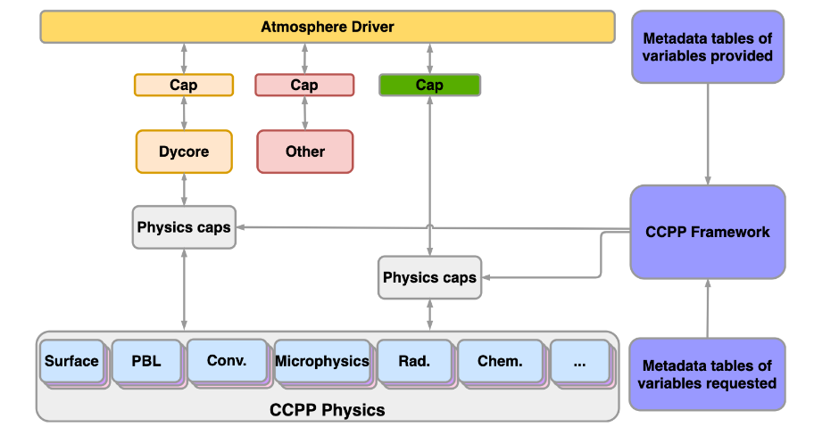
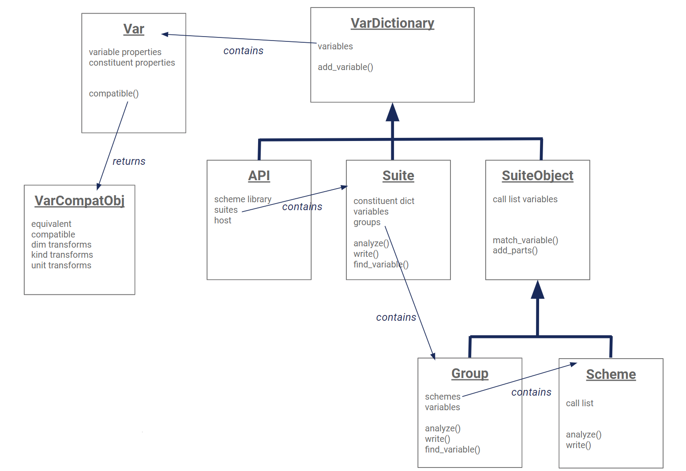
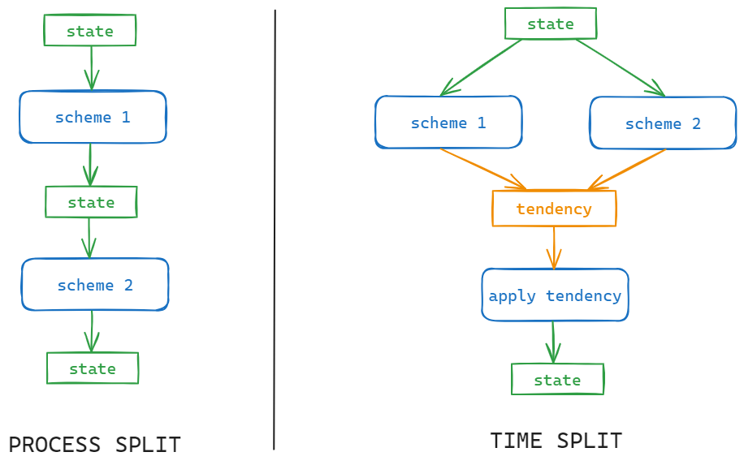

# CCPP in CAM-SIMA
## Overview
The core Common Community Physics Package (CCPP) documentation can be found [here](https://dtcenter.org/community-code/common-community-physics-package-ccpp/documentation). This section details the code structure and implementation of the CCPP Framework within CAM-SIMA. That said here's a quick overview of the CCPP:

- A CCPP-enabled model consists of the following components (depicted in the diagram below):
    - Host model and dynamical core
    - CCPP-compliant physics schemes (organized into Suite Definition Files [SDFs])
    - Caps generated by the CCPP framework to connect the host model to the physics schemes



CCPP-compliant physics schemes must adhere to the following criteria:

- Must be broken up into only the following phases:
    - *register* (anything in the scheme that must be done before the grid is initialized) - run once at startup
    - *init* - run once at startup
    - *timestep_init* - run at beginning of every physics timestep
    - *run* - run on every timestep
    - *timestep_final* - run at the end of every timestep
    - *final* - run once at the end of model execution
- Must contain metadata for all input/output/inout variables passed into each phase (see metadata example below)
- Must not have use statements outside of the following allowed CCPP use statements (with the exception of `dependencies`, but we're not getting into that now):
    - ccpp_kinds
    - ccpp_constituent_prop_mod

*Metadata example*
(snippet taken from `kessler.meta`)

```
[ precl ]
  standard_name = total_precipitation_rate_at_surface
  long_name = Total precipitation rate at surface
  units = m s-1
  dimensions = (horizontal_loop_extent)
  type = real | kind = kind_phys
  intent = out
[ relhum ]
  standard_name = relative_humidity
  long_name = Relative humidity
  units = percent
  dimensions = (horizontal_loop_extent, vertical_layer_dimension)
  type = real | kind = kind_phys
  intent = out
[ scheme_name ]
  standard_name = scheme_name
  units = none
  type = character | kind = len=64
  dimensions = ()
  intent = out

```

CCPP-compliant physics schemes are organized into suite definition files ([SDFs](https://ccpp-techdoc.readthedocs.io/en/v6.0.0/ConstructingSuite.html?highlight=sdf#constructing-suites)). An SDF tells the framework which schemes will be run in what order. Separating schemes into "groups" also allows the run phases of those groups to be called separately by the host model. Here's an example SDF (from suite_kessler.xml):
```
<?xml version="1.0" encoding="UTF-8"?>

<suite name="kessler" version="1.0">
  <group name="physics_before_coupler">
    <scheme>calc_exner</scheme>
    <scheme>temp_to_potential_temp</scheme>
    <scheme>calc_dry_air_ideal_gas_density</scheme>
    <scheme>wet_to_dry_water_vapor</scheme>
    <scheme>wet_to_dry_cloud_liquid_water</scheme>
    <scheme>wet_to_dry_rain</scheme>
    <scheme>kessler</scheme>
    <scheme>potential_temp_to_temp</scheme>
    <scheme>dry_to_wet_water_vapor</scheme>
    <scheme>dry_to_wet_cloud_liquid_water</scheme>
    <scheme>dry_to_wet_rain</scheme>
    <scheme>kessler_update</scheme>
    <scheme>qneg</scheme>
    <scheme>geopotential_temp</scheme>
    <scheme>cam_state_diagnostics</scheme>
    <scheme>kessler_diagnostics</scheme>
  </group>
  <group name="physics_after_coupler">
    <scheme>cam_tend_diagnostics</scheme>
  </group>
</suite>
```

The framework code is primarily python code that generates Fortran caps. The class structure looks like:

<figure markdown="span">
{width="80%"}
</figure>

Given CCPP-compliant physics schemes and one or more SDF, the framework generates caps for the host model to call at the appropriate time. The core files generated by the framework are:

- `<host>_ccpp_cap.F90`: contains the interface layer between the host and the suite(s)
- `ccpp_<suite>_cap.F90`: contains one subroutine per phase (including one run phase per group) in which the phases of the schemes within the suite are called in order
    - There is one suite cap generated for each suite being run
- `ccpp_datatable.xml`: consolidates metadata into an XML file to be used as desired by the host model

## Code Structure
Given the context above, this section describes how the CCPP is integrated into CAM-SIMA.

How CAM-SIMA and the CCPP come together:


### Host Model
The core host model code is what is held in the [CAM-SIMA](https://github.com/ESCOMP/CAM-SIMA/tree/development) github repository, plus code that is generated at build-time (or preview_namelists-time) based on the registry (`src/data/registry.xml`).

### Physics
The CCPP physics scheme code exists in the [atmospheric_physics](https://github.com/ESCOMP/atmospheric_physics) repository, which exists as a submodule of CAM-SIMA in the following location:
```$CAM-SIMA/src/physics/ncar_ccpp```

SDFs are located in the root directory of the repository and scheme source code is in the relevant subdirectories. 

The `diagnostics` directory contains all diagnostic schemes (the global ones used for state and tendency output, as well as the scheme-specific diagnostic schemes).

The `to_be_ccppized` directory contains physics schemes and utilties that have not been [CCPP-ized](../conversion/ccpp-conversion-guide.md), but were needed by an CCPP-ized scheme.

The `utilities` directory contains schemes that are used regularly, such as tendency applicators and state converters. See [below](#state-and-tendency-variables) for more.

### Generated caps
The caps generated by the CCPP Framework at model build time (or preview_namelists-time) can be found in the following location:
`$CASE/bld/atm/obj/ccpp/`

## Implementation
All CCPP phases are called from the physics driver (`src/physics/utils/phys_comp.F90`). You can see the order of these calls more thoroughly in the documented [run sequence](cam-run-process.md).

### Host-side variables and metadata
For a CCPP-ized physics scheme to work, the framework needs to be able to find a matching variable on the host side for each input variable for the suite(s) in question. This means that CAM-SIMA needs to allocate, initialize, and provide metadata for these variables. We do this in two ways:

- Adding metadata to existing CAM modules (such as `src/data/physconst.F90`) so that a scheme can access an existing host model variable
    - All static host-side metadata schemes are included at the top of the registry
- Adding a variable to the registry (`src/data/registry.xml`)
    - You can learn more about how the registry is used to generate a Fortran module and corresponding metadata [here](cam-build-process.md#cam-sima-source-and-namelist-generation-buildnml-workflow)

The registry-based code generator is run before the CCPP framework does its magic, so, when it's time, the framework can connect the dots between the host model and the physics.

### State and tendency variables

Two of the most commonly used and referred-to objects in CAM-SIMA are:

- **physics_state**
- **physics_tend**

The Fortran for both objects is auto-generated by CAM-SIMA based on the registry (`$CAM-SIMA/src/data/registry.xml`). The generated code can be found here: `$CASE/bld/atm/obj/cam_registry/physics_types.F90`. The objects are used by the host model (CAM-SIMA), while the CCPP physics take the individual component variables as inputs.

#### Physics state
The *physics_state* object in CAM-SIMA contains the current values for a select set of variables that describe the atmosphere, at the resolution specified by the input grid.

Some examples of these core "state" variables include temperature (`T`), eastward wind (`U`), and northward wind (`V`)

As a rule, CAM-SIMA physics schemes do not update the state directly and instead return tendencies (see below) which are then applied to the state later in the run phase. This is called *time splitting*, which means that all physics since the last state update get the same input state. The alternative, *process splitting*, means that the output state of one scheme serves as the input state of the next.

<figure markdown="span">
{width="70%"}
</figure>

NOTE: Although [constituents](constituents.md) are handled independently of the `physics_state` object (they are handled by the CCPP framework), they ARE considered state variables.

#### Physics tendencies
The physics tendencies represent how a given scheme (or schemes) changes the state in a single model timestep. The tendencies are accumulated until it is time to apply them to the state. There is one tendency for each state variable being "updated" by the scheme. Some of these tendency variables are held within the *physics_tend* object, but others are internal to the physics.

The module `$CAM-SIMA/src/physics/ncar_ccpp/utilities/physics_tendency_updaters.F90` includes the schemes to apply the tendencies to the relevant state variables. These schemes are added to the SDF whenever the state should be updated. Each calculation looks like: `state_var = state_var + tend*dt` where `dt` is the timestep size.