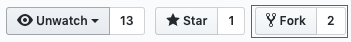

# Working with git and GitHub

## Getting started with git

- For a quick, visual introduction to git, try a [5 Minute Overview of Git](https://www.youtube.com/watch?v=xvwBtODV0ms) on Youtube
- Need an introduction to version control along with git and GitHub? Try [Git and GitHub for Poets](https://www.youtube.com/watch?v=BCQHnlnPusY), a Youtube series
- For a glossary of common terms used in git and GitHub documentation, see the [GitHub glossary](https://docs.github.com/en/get-started/learning-about-github/github-glossary).
- [GitHub's Git Handbook](https://docs.github.com/en/get-started/using-git/about-git) offers a brief overview of git and GitHub, including example workflows and links to more in-depth resources.
- Software Carpentry offers a [hands-on introduction to git](https://swcarpentry.github.io/git-novice/).
- A highly-regarded, comprehensive git reference is the book Pro Git (available as a [book](https://www.boulderbookstore.net/book/9781484200773) or a [free pdf](https://git-scm.com/book/en/v2)).
    - The first three chapters of Pro Git, along with sections 6.1 and 6.2 on GitHub, are particularly useful if you're getting started with git. [1]
    - The site also contains [links](https://git-scm.com/doc) to git reference pages along with introductory videos on git.
    - You can skip the last section of chapter 3, on rebasing, until you have more experience with git. It's easy to cause problems for yourself or others with rebasing so only use rebasing in CAM-SIMA following the workflow instructions below as rebasing rewrites history, which can make it impossible to reproduce exactly what you have done before.
- For a clear introduction to git internals, try [Dissecting Git Guts](https://www.youtube.com/watch?v=Y2Msq90ZknI) by Emily Xie.
- [Git from the inside out](https://maryrosecook.com/blog/post/git-from-the-inside-out) is a blog post with accommpaning video from Mary Rose Cook that looks under the covers a bit to show what happens when you execute git commands.
- [Git from the Bottom Up](https://jwiegley.github.io/git-from-the-bottom-up/) by Josh Wiegley provides a quick glossary of the main terms describing a git repository with links to detailed descriptions. Good site for reminders about a git concept.
- Need to really understand the science behind how git works? Try [Advanced Git: Graphs, Hashes, and Compression, Oh My!](https://www.youtube.com/watch?v=ig5E8CcdM9g) by Matthew McCullough

Git also offers extensive built-in (i.e., command line) help, although it can be hard to understand until you are familiar with basic git concepts:

`git help`

`git help COMMAND`

[man gittutorial](https://mirrors.edge.kernel.org/pub/software/scm/git/docs/gittutorial.html)

[man giteveryday](https://mirrors.edge.kernel.org/pub/software/scm/git/docs/giteveryday.html)

## How to set up your git development environment
There are several stages in setting up your git and GitHub development environment. Below, they are broken into three sections which represent the different stages:

- [One time GitHub setup](#one-time-github-setup)
- [Set up git environment on new machine](#set-up-git-environment-on-new-machine)
- [Working with clones](#working-with-clones)

### One time GitHub setup

1. Set-up personal github account (if one does not already exist): [https://github.com](https://github.com)
1. Create a new personal CAM-SIMA fork of the [ESCOMP/CAM-SIMA](https://github.com/ESCOMP/CAM-SIMA) repo:

    

1. Set up SSH keys on GitHub (optional):

    If you will be pushing changes to GitHub (either to your own fork or to shared forks), or if you will be pulling changes from private repositories on GitHub, then it's worth the time to set up ssh keys for each machine you'll be using. By doing so, you won't have to enter your password when pushing to or pulling from GitHub.

    See [here](https://help.github.com/articles/connecting-to-github-with-ssh) for instructions. After doing this, you can use the ssh form of GitHub URLs (e.g., `git@github.com:ESCOMP/cam-sima.git`) in place of the `https` form.

1. Configure GitHub notifications (optional): It is important to keep track of activity on GitHub but there are ways to manage how you are notified.
    - **Controlling how you receive notifications**: Click on your profile picture in the upper-right of any GitHub page, then click on "Settings", and then on "Notifications". You will see several options, here are a few recommended settings:
        - *Automatically watch repositories*: **Yes** (check box)
        - *Participating*: **Email**
        - *Watching*: **Web**
    - **To see and manage Web notifications**: Click on the bell in the upper right of any GitHub page to see Web notifications and to manage which repositories you are watching. There will be a blue dot on the bell if there are new (unread) notifications).

### Set up git environment on new machine
git has global settings which apply to all repository clones on your machine. These settings reside in a file called `.gitconfig` in your home directory. Below are some required and some optional but recommended global git settings to apply to any new machine where you will do CAM-SIMA development (e.g., Derecho, Izumi, personal laptop). Apply the settings below or simply copy a `.gitconfig` file from a machine that is already configured.

#### Required git global configuration settings
```
git config --global user.name "Your Name"
git config --global user.email <GitHub email address>
```

We recommend that you use your UCAR email address as your GitHub email address but if you use another address, you can add your UCAR email address by clicking on your profile picture in the upper-right of any GitHub page, then clicking on "Settings", and then on "Emails".

#### Recommended git global configuration settings
You can set which editor to use for log messages, etc., with:
```
git config --global core.editor <editor of your choice: emacs, vi, vim, etc>
```
(See [http://swcarpentry.github.io/git-novice/02-setup](http://swcarpentry.github.io/git-novice/02-setup) for specific settings to use for many common editor choices.)

The following setting generates better patches than the default:
```
git config --global diff.algorithm histogram
```
The following setting makes it easier to resolve conflicts if you're doing conflict resolution by hand as opposed to with a dedicated conflict resolution tool. Without this setting, you'll just see your version and the version you're merging in delimited by conflict markers. With this setting, you'll also see the common ancestor of the two sides of the merge, which can make it much easier to figure out how to resolve the conflict:
```
git config --global merge.conflictstyle diff3
```
Alternatively, look into using a graphical conflict-resolution tool such as kdiff3 or the Emacs built-in `M-x vc-resolve-coflicts`.

We recommend that you set git to not push anything by default:
```
git config --global push.default nothing
```
This can help prevent you from accidentally pushing work to the wrong repository.

#### Configuring git on shared machines
If using git on shared resources, such as on the login nodes for CISL machines, then one may find their git commands being killed by sys admins due to git spawning too many threads and thus blocking (or at least slowing down) other users. To avoid this situation, you can limit the number of threads git spawns for various activities by setting the following git config variables:
```
git config --global --add index.threads 8
git config --global --add grep.threads 8
git config --global --add pack.threads 8
```
Please note that a limit of 8 threads was chosen specifically for CISL machines. If you are using a separate shared system you may find it beneficial to choose a different thread limit.

#### git tools for Bash
There are two helpful things you can do to streamline your use of git if you use the bash shell. These are completely optional, but improve your git experience. These are documented in the appendix of the excellent Pro Git book.

### Updating your login to a GitHub token
If you have been denied access to push to a GitHub repo, note that the old password system has been deprecated and no longer works. If you do not make changes, you will no longer be able to work with GitHub on personal forks and private repos.

If you only ever git clone from public repositories like ESCOMP and ESMCI, you may ignore the rest of this wiki page.

If you've already created and are using a GitHub token, you may ignore the rest of this wiki page.

GitHub will soon be requiring that you use a GitHub generated token (basically a long password that they autogenerate for you).

1. If you are on a Mac and do not need to use your password, but still receive an error message, you may have stored your password in the keychain. [Remove a password on Macs](https://docs.github.com/en/github/getting-started-with-github/getting-started-with-git/updating-credentials-from-the-macos-keychain)
1. [Create a GitHub password token](https://docs.github.com/en/github/authenticating-to-github/creating-a-personal-access-token). Make sure you copy it to a safe place as they only show it to you once.
1. Store your credentials on every machine you use GitHub on.
    - On a private / secure Linux system:

        ```
        git config --global credential.helper store
        ```

    - Note that the `store` option to git's credential helper stores your GitHub token in plain text. If you are on a public machine, you should store your GitHub token in a password manager and use the credential cache mechanism to open command-line access to your GitHub repositories:

        ```
        git config --global credential.helper cache --timeout <seconds>
        ```
    
        where `<seconds>` is the number of seconds git 'remembers' your token. For example, to only have to enter your token once per day:

        ```
        git config --global credential.helper cache --timeout 86400
        ```

    - On Windows:

        ```
        git config --global credential.helper wincred
        ```
    - On Macs (make sure you select the Mac tab in the middle of the window): see [this documentation](https://docs.github.com/en/github/getting-started-with-github/caching-your-github-credentials-in-git)

1. On each machine, do a `git clone` of your personal repo. It will ask for your username and password. The password needs to be your saved token. You should only need to do this once.
1. To test that your credentials are successfully cached, do a new `git clone` of your personal repo. If it clones without asking for your username/password you are done.

## Working with clones
Here are some commands for creating and working with clones:

### Create a new clone
```
git clone https://github.com/<GitHub userid>/CAM-SIMA
cd CAM-SIMA
```
or
```
git clone git@github.com:<GitHub userid>/CAM-SIMA
cd CAM-SIMA
```
where `<GitHub userid>` is your GitHub account login ID. Some useful options to the clone command are:

- `--origin <origin name>`: A clone knows where it came from and by default, calls that location, "origin". You can change that name with the `--origin` option. This can come in handy when dealing with multiple upstream repositories.
Change the clone directory name: By default, the clone is created in a directory with the same name as the repository. You can change this by adding a directory name to the clone command. Use the appropriate example below:

```
git clone https://github.com/<GitHub userid>/CAM-SIMA  <clone_dir_name>
cd <clone_dir_name>
```
or
```
git clone git@github.com:<GitHub userid>/CAM-SIMA <clone_dir_name>
cd <clone_dir_name>
```

### Checking out a tag or switching to a new tag

- To check out a tag: 
```
git checkout <tag>
```

note that `<tag>` can also be the name of a branch or a commit hash. If you specify the name of a branch, you will check out the head of the branch. If you name a remote branch (e.g., `origin/branch_name`), you will create a detached HEAD but you can still use the code. Please note that if you plan on changing the code, first create a branch (see [Working with branches](#working-with-branches)

### Working with branches
When you create a clone, your clone will contain pointers all the branches that existed at the clone's origin (e.g., the repository at GitHub). While you can check out these branches, however, before attempting to make any changes, you should first create a local version branch (so git can keep track of the local commits).

- To create a new local branch that starts at a certain point:

```
git branch <new branch name> <tag or branch name>
```
for example
```
git branch new_feature cam6_2_024
```

- To check out a local branch:
```
git checkout <new branch name>
```
- If you are working with a repository that uses [`git-fleximod`](git-fleximod.md) (e.g., CAM-SIMA, CESM), always run that tool after checking out a new branch or tag:
```
bin/git-fleximod update
```

### Working with remotes (upstream repository locations)
While working with clones created using the methods above will be sufficient for most if not all of your development needs, there may be times when you will want to access or compare your code with code from a different repository. git has no problem storing revisions from multiple repositories in a single clone!

To begin, your clone probably has a single remote (also known as an upstream repository). To see the current status of which upstream repositories are configured for your clone, use the `git remote` command:
```
git remote
```

To see the location of the remote repositories in your current directory:
```
git remote -v
```

You should see something like:
```
origin  https://github.com/gituser/CAM-SIMA (fetch)
origin  https://github.com/gituser/CAM-SIMA (push)
```
This tells you the "upstream" location from where new code is downloaded (when you run `git fetch origin`) or where code is uploaded (when you run `git push origin <branch>`). Note that most `git` commands are purely local, using only information in the .git directory of your clone.

You can rename an existing remote:
```
git remote rename origin ESCOMP
```

You can set the remote name as part of a clone command (the default is 'origin'):
```
git clone -o ESCOMP https://github.com/ESCOMP/cam-sima
```

#### Adding remote (new upstream repository locations)
To add a new upstream repository, use the `remote add` command. For example:
```
git remote add ESCOMP https://github.com/ESCOMP/CAM-SIMA
git fetch --tags ESCOMP
```
You should see messages much like a new clone when you execute the `git fetch` command. Note that you can call the new remote anything, in this example we are calling it ESCOMP.

## Updating your branch to latest development
Note that while this section explains how to update your local branch to the `ESCOMP/CAM-SIMA/development` branch, the instructions can easily be generalized for any branch from any upstream remote.

Before starting, you should have either:

- A fresh clone of your fork with the branch you wish to update checked out (see [Create a new clone](#create-a-new-clone) and [Working with branches](#working-with-branches).
- An existing clone with the branch you wish to update checked out and in a clean state (i.e., make sure you do a `git commit` and that `git status` shows no modified files).

Add the upstream remote, if you have not already done so (see [Adding remotes](#adding-remote-new-upstream-repository-locations)).

Merge the specific remote/branch into your branch. In this example, it is ESCOMP/development
```
git fetch ESCOMP
git merge ESCOMP/development
```

## Comparing differences using git diff
If you have a git clone, you can view differences between commits or tags. As far as `git diff` is concerned, a commit hash is the same as a tag so in the examples below will use `<tag>`.

- To see the full difference between two tags (i.e., a changeset):
```
  git diff <tag1> <tag2>
```
- To see the full difference between the current checkout (sandbox) and a tag:
```
  git diff <tag>
```
- To see only the names of files that are different:
```
  git diff --name-only <tag> [ <tag2> ]
```
- To see the difference in one or more specific files:
```
  git diff <tag> [ <tag2> ] -- <path_to_file1> <path_to_file2>
```

### Configuring and using a graphical difference tool
git has a command, `difftool`, that can run a graphical tool on each file that is different between two commits.

- To configure `opendiff` as the graphical difference tool:
```
  git config --global diff.tool opendiff
```
- To see the available graphical difference tools:
```
  git difftool --tool-help
```
- To run `difftool` on `<file1>` and `<file2>`
```
  git difftool <tag> [ <tag2> ] -- <path_to_file1> <path_to_file2>
```
- To optionally run `difftool` on all files in a changeset (answer 'y' or 'n' for each file):
```
  git difftool <tag> [ <tag2> ]
```
- To run `difftool` on all files in a changeset (i.e., same as 'y' for every file):
```
  yes | git difftool <tag> [ <tag2> ]
```

### Using `diffmerge`
This section contains the complete modifications needed for using the graphical tool diffmerge for "git difftool" and "git mergetool"

There is a tool called `diffmerge` which enables both side-by-side comparison of edited files in git as well as providing a three way-pane for editing merge conflicts. This tool is available for download at: [https://sourcegear.com/diffmerge/](https://sourcegear.com/diffmerge/). It has been installed on izumi and derecho by the system administrators in public areas, so you don't need to download it for those machines.

To use the differencing tool type: `git difftool`

If after a `git merge` the git command says there are conflicts, then you may type `git mergetool` to allow you to resolve the conflicts and complete the merge. The mergetool with diffmerge properly installed will display three panes. From left to right these panes are: 

    Code being merged in          Merged code               Your code

The panes are opened in a visual editor, and any changes you make in the middle pane, may be saved by selecting the save icon at the top of the screen and then exiting the window. This will finalize the merge for that particular file.

For a presentation which can be used as a tutorial, you may refer to: [Presentation on diffmerge tool for git](https://docs.google.com/presentation/d/1BqrbnpZjjaODVjAtLUCfj-OeBC_4jTPa/edit#slide=id.g2c48a8cae8d_0_75)

The following modifications may be copy/pasted into the user's `.gitconfig` file which resides in the home directory. Since the potential for making an editing mistake is possible, it is recommended that a copy be made of the `.gitconfig` file prior to these edits in case an error is discovered.

If you have problems, check out the tips at the bottom of this page
```
[diff]
        tool = diffmerge
        algorithm = histogram
[difftooldiffmerge]
        cmd = diffmerge \"$LOCAL\" \"$REMOTE\"
[difftool "diffmerge"]
        cmd = diffmerge \"$LOCAL\" \"$REMOTE\"
[difftool]
        prompt = false
[push]
        default = simple
[merge]
        tool = diffmerge
        ff = false
[mergetool "diffmerge"]
        cmd = diffmerge --merge --result=$MERGED $REMOTE $BASE $LOCAL
[mergetool]
        keepBackup = false
```

**Useful tips**

- On derecho, if you get an error message about diffmerge not being loaded, make sure you are using `ncarenv/23.09` or newer (to check say "module list")
- If you do not get a response when clicking on the "git mergetool" window, make sure you find the "conflict" popup and hit "exit" on it
- If your git mergetool gives blank windows and says: "Files are identical or equivalent under the current RuleSet", hit OK and then go to the File dropdown menu and select "Reload". This filled in the blank windows for the user with this error. 
    - **CAUTION**: Check your file carefully if you do this, as a second user who did this discovered that all of the changes which were automatically merged did not reside in the final saved version.
